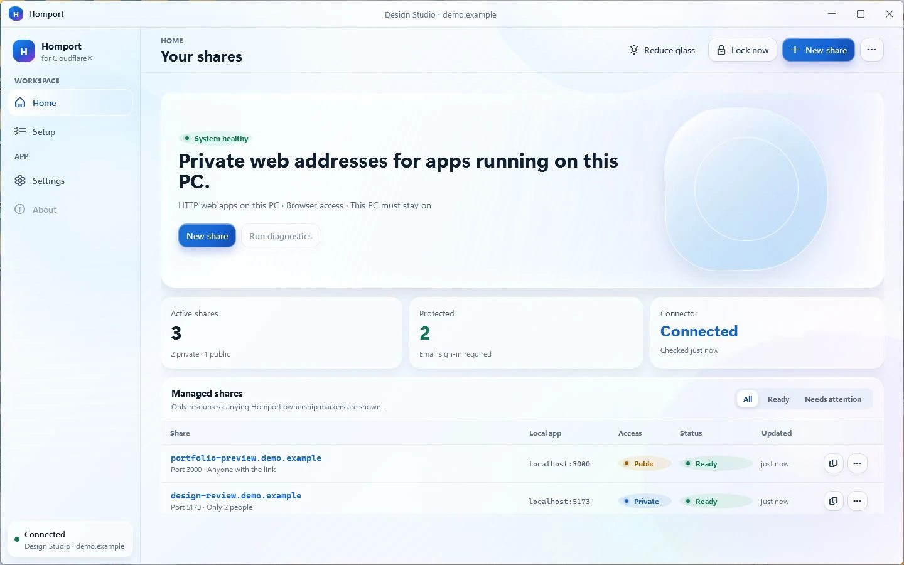

# Homport

**Your local web app. A link you can share.**

[Website & interactive demo](https://homport.dev/) · [Getting started](docs/getting-started.md) · [FAQ](docs/faq.md) · [Support](https://homport.dev/support/) · [Privacy](https://homport.dev/privacy/)

Homport is a Windows app that gives a compatible web app running on your PC a web address on your own domain. Share it privately with people you choose, or make it public after confirmation. It uses **your own Cloudflare account**, Cloudflare Tunnel and Cloudflare Access, without opening router ports or requiring visitors to install a VPN.

*Actual Homport app with illustrative demo data. Explore the animated sharing walkthrough on [homport.dev](https://homport.dev/).*

## Availability

The first release will be **free**, distributed through the **Microsoft Store**. Store publication is being prepared; this repository does not offer an installer or announce a released version. Check the [website](https://homport.dev/) for availability. Domain registration and any Cloudflare charges are separate.

## From your PC to their browser

1. **Connect your account.** Sign in to Cloudflare and complete the domain and Zero Trust setup checks.
2. **Choose a local web app.** Select its local HTTP address, pick a subdomain and choose who can access it.
3. **Check and share.** Homport checks the connection. Once ready, copy the link and send it using your preferred messenger or email app.
4. **Open the link.** Visitors see the web app in their browser. Private links first require an email code for an allowed address.

Homport does not send messages for you. The shared content comes from your local web app; your PC and that app need to stay running and connected.

## What you can manage

| Feature | What it does |
| --- | --- |
| Private sharing | Restrict a web address to allowed email addresses through Cloudflare Access. |
| Public sharing | Let anyone with the address reach the web app after you confirm public access. |
| Share dashboard | See links and their status, copy an address, or turn off a share. |
| Lock now | Stop this PC's connector while keeping the configuration for later. |
| Diagnostics | Check the local app, connector, DNS and access protection when a link needs attention. |
| Tray controls | Keep Homport available while its window is closed, and open or quit it from the tray. |

## What you need

- Windows 10 version 2004 (build 19041) or later, or Windows 11, on an x64 PC.
- Your own Cloudflare account, a domain using Cloudflare nameservers, and Cloudflare Zero Trust set up.
- A compatible **HTTP web app on localhost**. Compatibility is checked before a share is marked ready.
- A PC that remains on, connected to the internet and signed in to Windows.

Homport is intended for browser-based access to compatible web apps. It is not designed for video streaming, camera feeds, large file storage or uploads, or arbitrary native-app protocols. It does not host your app on a developer server.

## Documentation & help

- [Getting started](docs/getting-started.md): setup, private sharing and stopping access.
- [Frequently asked questions](docs/faq.md): privacy, compatibility, cost and availability.
- [Support & safe bug reports](SUPPORT.md): what to include and what to keep private.
- [Report a security concern](SECURITY.md): private reporting instructions.
- [Cloudflare OAuth for desktop apps](docs/oauth-cloudflare-desktop.md): implementation notes about PKCE, loopback callbacks, scopes and practical pitfalls. These are developer notes, not setup steps for Homport users.

This is Homport's public product and documentation repository. Application source code and internal release evidence remain private. The desktop app has no developer backend or developer telemetry; the website uses Cloudflare Web Analytics as described in the [privacy policy](https://homport.dev/privacy/).

Independent third-party app, not affiliated with or endorsed by Cloudflare, Inc. Cloudflare is a registered trademark of Cloudflare, Inc.

The documentation is available under [CC BY 4.0](LICENSE). That license does not grant rights to the Homport application source code or branding.
